# Agent System Architecture

## Topology

```mermaid
flowchart TD
    A1["agent_system: 智能体系统根目录"]

    B1["main_scheduler: 主调度器"]
    A1 --> B1
    B1:::scheduler

    U1["user_preferences: 用户偏好"]
    U1:::user

    E1["user_analyst: 用户分析专家"]
    E2["ops_expert: 运营专家"]
    E3["render_expert: 渲染专家"]
    E4["audit_expert: 核查专家"]
    A1 --> E1
    A1 --> E2
    A1 --> E3
    A1 --> E4
    E1:::expert
    E2:::expert
    E3:::expert
    E4:::expert

    S1["voc_insight: 用户洞察"]
    S2["ops_dashboard: 运营看板"]
    S3["dashboard_html: 看板渲染"]
    S4["superpowers: 思考辅助"]
    S5["briefing: 过程汇报"]
    S6["audit: 核查"]
    A1 --> S1
    A1 --> S2
    A1 --> S3
    A1 --> S4
    A1 --> S5
    A1 --> S6
    S1:::skill
    S2:::skill
    S3:::skill
    S4:::skill
    S5:::skill
    S6:::audit

    subgraph InsightFlow["insight_flow: 洞察流程"]
        I1["Step1 voc_insight: 用户洞察<br>输入: VOC/评论/竞品/质量反馈<br>输出: 用户洞察结论<br>主: 用户分析专家<br>用户守门: True"]
        I2["briefing: 过程汇报（可选）"]
        I1 -.-> I2
    end

    subgraph DashboardFlow["dashboard_flow: 看板流程"]
        D1["Step1 voc_insight: 用户洞察"]
        D2["Step2 ops_dashboard: 运营看板<br>输出: 产品运营报告与Dashboard结构<br>主: 运营专家<br>用户守门: True"]
        D3["briefing: 过程汇报（可选）"]
        D1 --> D2
        D2 -.-> D3
    end

    subgraph HtmlFlow["html_flow: 网页流程"]
        H1["Step1 voc_insight: 用户洞察"]
        H2["Step2 ops_dashboard: 运营看板"]
        H3["Step3 dashboard_html: 看板渲染<br>输出: HTML/PDF<br>主: 渲染专家<br>用户守门: False"]
        H4["audit: 核查（可选）"]
        H1 --> H2
        H2 --> H3
        H3 -.-> H4
    end

    B1 --> InsightFlow
    B1 --> DashboardFlow
    B1 --> HtmlFlow

    E1 --> S1
    E2 --> S2
    E3 --> S3
    E4 --> S6

    E1 -.->|按需辅助| S4
    E2 -.->|按需辅助| S4
    E4 -.->|按需辅助| S4

    S1 -.->|关键节点完成| S5
    S2 -.->|关键节点完成| S5
    S3 -.->|关键节点完成| S5

    U1 -.-> E1
    U1 -.-> E2
    U1 -.-> S1
    U1 -.-> S2
    U1 -.-> S3

    classDef scheduler fill:#f9f,stroke:#333,stroke-width:1px;
    classDef expert fill:#bbf,stroke:#333,stroke-width:1px;
    classDef skill fill:#bfb,stroke:#333,stroke-width:1px;
    classDef user fill:#ffb,stroke:#333,stroke-width:1px;
    classDef audit fill:#f99,stroke:#333,stroke-width:1px;
```



## Node Mapping

- `main_scheduler（主调度器）`：调度层入口，配置位于 `scheduler/main_scheduler/`。
- `voc_insight（用户洞察）`：分析类 Skill，消费 VOC、评论、竞品和质量反馈。
- `ops_dashboard（运营看板）`：报告生成类 Skill，输出产品运营报告和 Dashboard 信息架构，是看板场景的最终业务内容输出者。
- `dashboard_html（看板渲染）`：UI 渲染类 Skill，只消费运营看板结构化输出并生成 HTML/PDF。
- `superpowers（思考辅助）`：专家层按需调用的辅助判断能力，不进入主流程。
- `briefing（过程汇报）`：关键节点完成后的通用过程汇报能力，不为每个 Skill 复制私有汇报节点。
- `audit（核查）`：交付前或用户查询时触发的质量门禁和日志核查能力。
- `user_analyst（用户分析专家）`：主调 `voc_insight（用户洞察）`。
- `ops_expert（运营专家）`：主调 `ops_dashboard（运营看板）`。
- `render_expert（渲染专家）`：主调 `dashboard_html（看板渲染）`。
- `audit_expert（核查专家）`：主调 `audit（核查）`。

## Sedimentation Governance Layer

> Round 13 合同测试完整；Round 14 Runtime Wiring 进行中

所有候选沉淀内容（私聊、PBI、用户纠正、工具失败、gstack 输出）经由统一入口
`MemoryEvent` 进入系统，由 `MemoryDispatcher` 按 10 条规则路由到 5 个目标之一。
不确定内容进入 `StagingStore`，永不被静默丢弃。所有回读内容携带 `UsageHint`。

### 数据流

```
任意内容来源（私聊/PBI/用户纠正/gstack/工具失败）
    ↓
MemoryEvent(source_type, actor_user_id, risk_flags, recommended_destination, ...)
    ↓
MemoryDispatcher.dispatch_event(event) → DispatchResult
    ├─ personal_memory   — 用户偏好、纠正（已确认 scope）
    ├─ project_process   — PBI、版本计划（有 project_hint）
    ├─ knowledge         — KnowledgeCandidate payload → knowledge_write
    ├─ experience_card   — 结构化行动卡（DAVID_CARD 等）
    └─ staging           — 条件不足（不丢失，等待下一步 ops）

所有回读路径:
    任何存储 → wrap_with_hint(content, hint) → prompt
```

### 三层经验写入 ACL

```
system_mem:  仅 caller_id="hermes_main" 可写（experience_layer.py 强制）
expert_mem:  仅 caller_id 与 expert_id 匹配可写
skill_mem:   仅 caller_id 与 skill_id 匹配可写
gstack 任何输出 → 必须走 candidate → dispatcher → ACL 审核
```

### gstack 专家层路由（feature flag 守卫，默认 OFF）

```
gstack output → gstack_bridge.route(output_type)
    review    → audit_evidence
    fact      → knowledge_candidate
    lesson    → expert_mem_candidate
    playbook  → skill_asset
    action_rule → experience_card_candidate
    uncertain → staging(needs_project_mapping)
```

### Feature Flags（全部默认 OFF）

- `SESSION_CAPTURE_AUTO_ENABLED` — session_capture.capture_turn() 自动触发
- `USAGE_HINT_INJECTION_ENABLED` — 回读内容携带 usage_hint
- `GSTACK_SEDIMENTATION_ENABLED` — gstack 输出进入沉淀链

### 存储布局

```
{HERMES_HOME}/
├── memory_events/events.jsonl         — MemoryEvent 流水
├── staging/staging.jsonl              — 暂存区（不确定内容）
├── memory_relations/relations.jsonl   — 强关系图
├── project_process/records.jsonl      — 项目流程记录
├── experience_cards/cards.jsonl       — 结构化行动卡
└── knowledge/pending_captures.jsonl   — pending 重放队列
```

### 关键模块（agent/ + agent_system/sedimentation/）

| 模块 | 职责 | runtime 状态 |
|------|------|-------------|
| memory_event.py | MemoryEvent 创建/写入/读取 | wired (Round 14) |
| memory_dispatcher.py | 10规则5目的地分流 | wired — session_capture/knowledge_tool/cli_bridge 调用 |
| staging_store.py | StagingEntry + approve/reject/archive/stats | wired + ops tool |
| usage_hint.py | 6类 hint，wrap_with_hint | wired — memory_manager + knowledge_query (flag OFF) |
| experience_card.py | ExperienceCard，DAVID_CARD，ephemeral injection | wired — trigger_check+render_card 接入 run_agent.py；cards.jsonl 仅手动 smoke/seed，不代表自动 runtime authoring |
| session_capture.py | 会话风险探测，emit MemoryEvent | wired — run_agent.py SESSION_CAPTURE_AUTO_ENABLED gate |
| sedimentation/experience_layer.py | 三层 ACL（system/expert/skill） | wired — runtime._append_private_memory 非破坏性包装 |
| sedimentation/gstack_bridge.py | gstack → 沉淀链 | wired — route_gstack_result 接线（flag OFF by default） |

## Flow Rules

- `insight_flow（洞察流程）`：适用于用户只要分析结论，最终业务输出来自 `voc_insight（用户洞察）`。
- `dashboard_flow（看板流程）`：适用于用户需要产品运营 Dashboard，最终业务输出来自 `ops_dashboard（运营看板）`。
- `html_flow（网页流程）`：适用于用户需要 HTML/PDF，最终呈现输出来自 `dashboard_html（看板渲染）`。
- 系统不再设置通用 `final_report（最终报告）` 主链路节点；每类报告由对应业务报告 Skill 输出。
- `dashboard_html（看板渲染）` 不重新判断结论、不改写运营建议、不替代 `ops_dashboard（运营看板）`。
- `audit（核查）` 检查结论一致性、字段完整性、流程状态、用户守门和审计日志。
